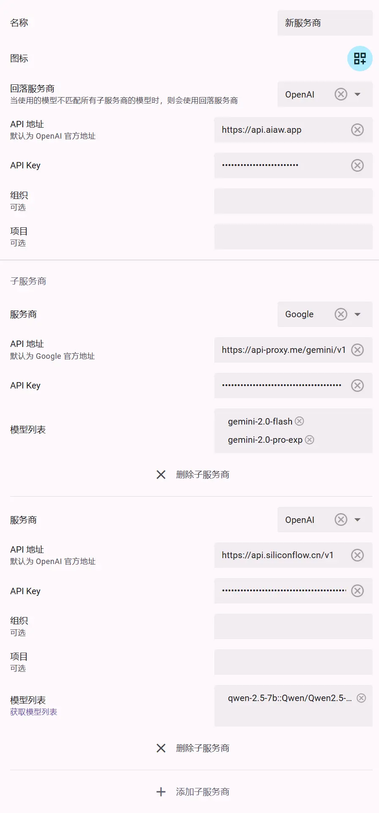

# Custom Provider

If you only want to configure a single service provider/relay station, you can select the service provider on the settings page and configure API Key and other settings. However, if you want to configure multiple service providers at the same time and use different service providers for different models, you need to **create a custom service provider**.

## Usage Example

Consider a custom service provider configured as shown in the figure:

The effect is:
- For `gemini-2.0-flash` and `gemini-2.0-pro-exp` models, use the Google service provider
- For the `qwen-2.5-7b` model, use the OpenAI format service provider `api.silliconflow.cn`, and remap the model name to `Qwen/Qwen2.5-7B-Instruct`
- For other models, use the fallback service provider (OpenAI format `api.aiaw.app`)

The created custom service provider will be an option as a service provider, you can set it as the default service provider, or the service provider for a specific assistant

### Model Name Remapping

Use `::` in the model value to achieve model name remapping. The left side of `::` is the model name you use in the conversation/settings, and the right side is the model name actually used in the request. For example, `qwen-2.5-7b::Qwen/Qwen2.5-7B-Instruct` means mapping `qwen-2.5-7b` to `Qwen/Qwen2.5-7B-Instruct`
